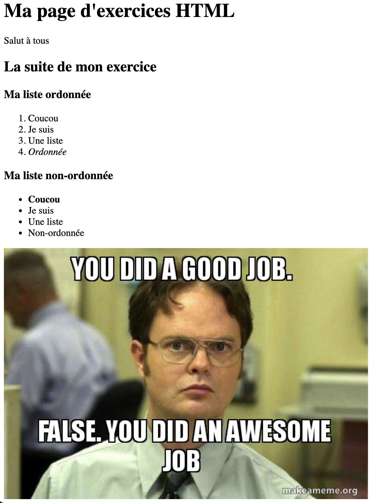

# Exercices intermédiaires

Voici quelques exercices simples pour apprendre à manipuler un peu toutes les balises HTML qu'on vient de voir.

## :memo: Objectifs

- Réaliser sa première page HTML en utilisant les balises vues dans la théorie
- Suivre des consignes précises

## :white_check_mark: Evaluations

- Respect des consignes
  - La page présente tous les éléments demandés
- La syntaxe est correcte
- L'indentation est correcte

## Exercice 0

Avant de te lancer, si tu veux tu peux revoir ce dont on a déjà parlé dans le cours en réalisant [les exercices sur W3School](https://www.w3schools.com/html/exercise.asp?filename=exercise_html_attributes1).

Sujets déjà abordés (correspondant aux sections des exercices sur W3School):

- Attributes
- Headings
- Paragraphs
- Comments
- Links
- Images
- Tables
- Lists
- Classes
- ID

> :exclamation: Il y a sûrement des réponses que tu ne trouveras pas car nous ne l'avons pas spécialement vu dans le cours. Mais tu peux retrouver un lien vers la documentation du sujet concerné si tu veux essayer de trouver par toi même. N'hésite pas à poser des questions!

## Exercice 1-1

Il est temps de réaliser ta première page. Suis bien ce pas-à-pas. 

1. Ouvre VSCode
2. Crée un nouveau document `HTML` et nomme le `exercice-1.html`.
3. Sauvegarde-le dans un dossier `Mes exercices HTML` dans le dossier `Mes Documents` de ton ordinateur.
4. Écris le squelette de base d'une page HTML avec l'abréviation d'Emmet (!)
5. Ajoute un `paragraphe` et écris une petite phrase pour saluer le visiteur.

## Exercice 1-2

1. Toujours dans le même document, ajoute un `Titre de niveau 1` au dessus de ton paragraphe en indiquant la phrase suivante `Ma page d'exercices HTML`
2. Dans le balise `Head` tu trouveras la balise `Title`. Change donc le titre par celui que l'on vient d'ajouter plus haut (Ma page d'exercices HTML)

## Exercice 1-3

1. Toujours dans le même document, ajoute un `Titre de niveau 2` en dessous de ton paragraphe et indique la phrase suivante `La suite de mon exercice`
2. Englobe ton `titre 1` et son paragraphe dans une balise `div`
3. Englobe ton `titre 2` dans une balise `div` différente.

## Exercice 1-4

1. Ajoute une balise `titre 3` à la suite de ton titre de niveau 2 et indique `Ma liste ordonnée`
2. Crée une liste ordonnée à la suite de ton titre 3 avec 4 `list item` au choix.
3. Ajoute un `titre 3` à la suite de cette liste et indique `Ma liste non-ordonnée`
4. Crée une liste non-ordonnée à la suite de ton titre 3 avec 4 `list item` au choix.

## Exercice 1-5

1. Mets quelques mots en évidence dans tes listes avec les balises `em`, `strong` ou place des `span` qui serviront dans un future exercice et donne leurs une `class` qui a du sens.
2. Mets une `image` en dessous de ta page.
3. Fais en sorte que quand on clique sur ton image on arrive sur le site de Google.

## Résultat

Tu devrais avoir quelque chose dans ce goût-là. Si c'est le cas, tant mieux tu peux passer à [l'exercice suivant](6-exercice-recette.md). Sinon, revois la théorie et pose des questions!

[:rewind: Retour au sommaire du cours](./README.md#table-des-matières)
