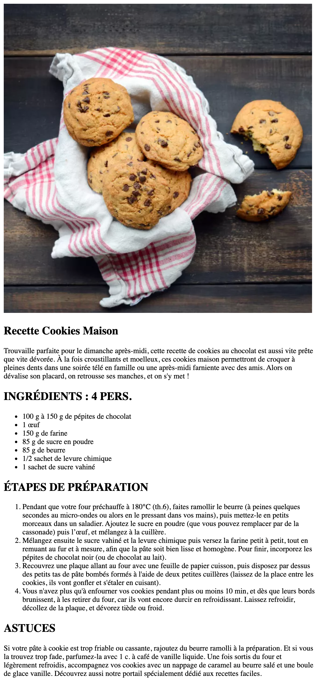

# Exercice - La recette

Quoi? Comment? Déjà un exercice? Mais comment cela est-il possible? Et bien on a déjà vu assez de théorie que pour commencer ton premier exercice en HTML!

## Consignes

- Ouvre VSCode
- Réalise une page en HTML que tu nommeras `ma-recette.html`. Sauvegarde-là dans le dossier `Mes documents` de ton ordinateur. 
- Parles d'une recette de cuisine qui te plaît et mets-là en page en utilisant la structure HTML de base et quelques balises vues dans la théorie.
- Change le titre de la page pour qu'il indique bien qu'il s'agit de ta recette.
- Utilise les balises `section` pour séparer ton contenu (résumé, ingrédients, étapes de préparation,...)
- Utilise des balises `p`pour écrire quelques lignes sur pourquoi tu aimes cette recette.
- Utilise une balise `img` pour placer une image de ta recette
- Utilise une liste ordonnées pour les étapes de préparations et une liste non-ordonnées pour la liste des ingrédients.
- Mets en valeur les éléments importants de ta recette avec les balises `strong`et `em`.
- Ne te pré-occupe pas pour l'instant de la forme, on ne fait que mettre nos éléments à place, on embellira tout ça plus tard.
- (bonus) insère un tableau avec des infos dedans.

## Compétences acquises au terme de l'exercice

- Suivre une liste d'objectifs
- Apprendre à se débrouiller en allant lire la théorie vue ou la documentation
- Apprendre les bases d'HTML

## Astuces / Allez plus loin

- Retournez lire la théorie vue plus tôt
- Pourquoi ne pas essayer d'insérer une Google Font?
- Si vraiment tu veux aller plus loin, tu peux essayer une mise en page avec `Flexbox` ou en `Grid` mais pas de panique on verra ça ensemble par après.

## Courage!

Cet exercice peut te sembler impossible mais ne t'en faites pas, le but ici c'est d'essayer d'allez le plus loin possible et d'apprendre à chercher un peu par soi même. Nous approfondirons tes connaissances avec la suite de la matière et lors d'autres exercices ;) 

## Exemple

[:rewind: Retour au sommaire du cours](./README.md#table-des-matières)
