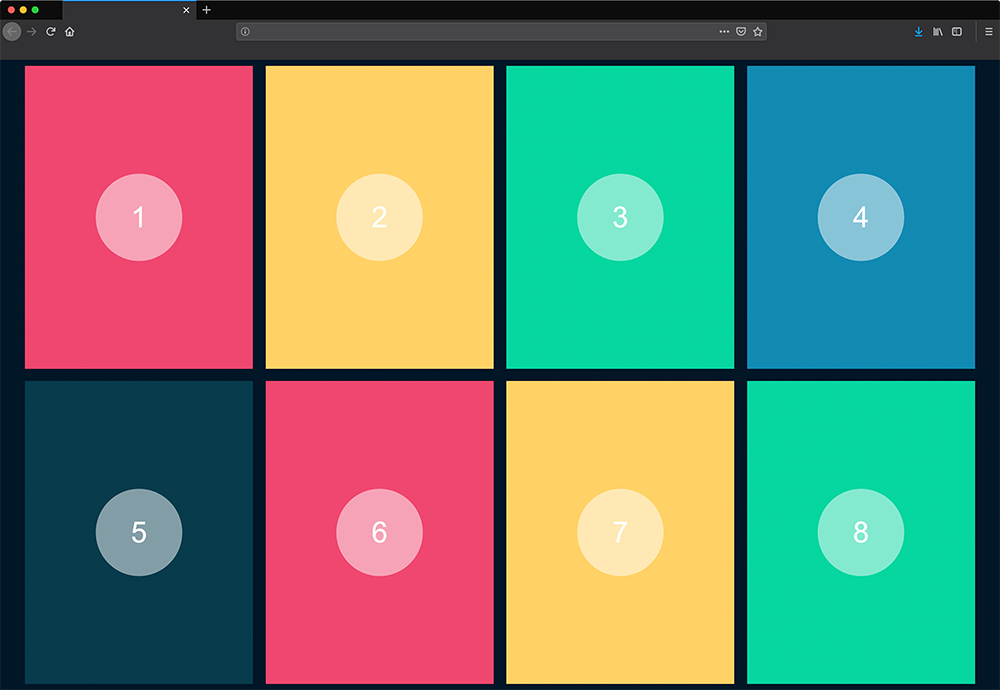
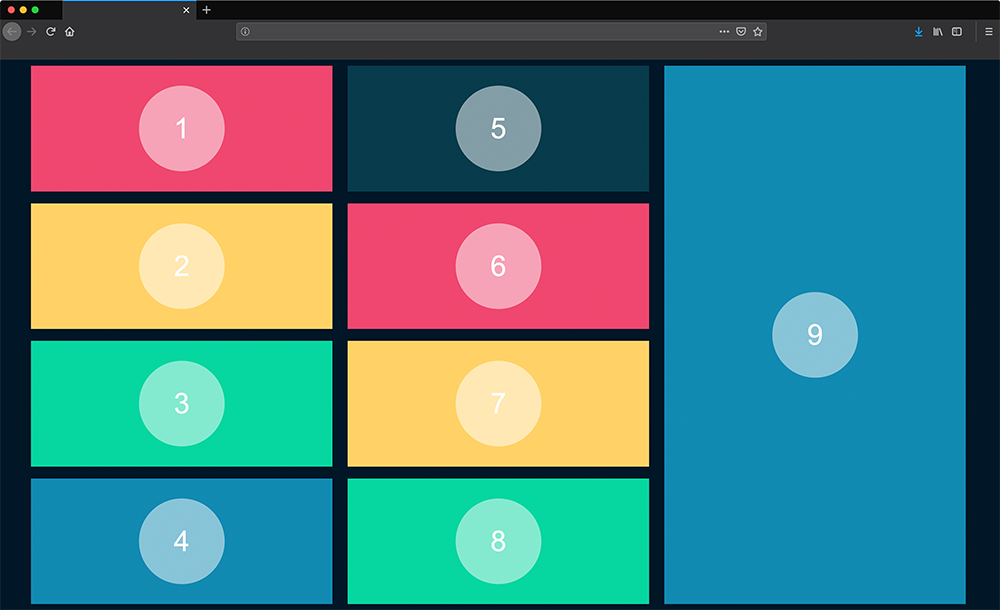
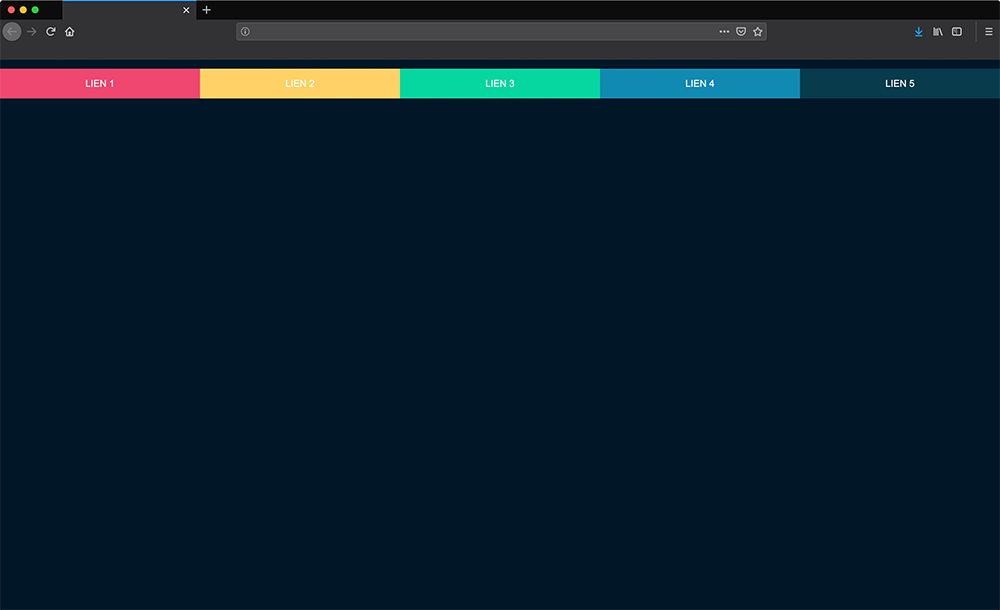

# Exercices Flexbox

## Allez on se détend avec un petit jeu

Essayez de compléter un max d'exercice sur ce petit jeu, ça vous aidera a encore mieux visualiser les différentes propriétés liés à Flexbox.

[Flexbox Froggy](https://flexboxfroggy.com/#fr)

## Maquette Discord (optionnel)

[Reprends la maquette "Discord" qu'on a fait plus tôt](11-exercice-css-maquette-discord.md) et essaye de changer le header, la nav et les sections en `display:flex`.

## Exercices 

### Exercice 1

Reproduis la mise en page suivante.



Pour ce faire tu auras besoin du code HTML et CSS suivant:

```html
<!DOCTYPE html>
<html lang="en">
<head>
  <meta charset="UTF-8">
  <meta name="viewport" content="width=device-width, initial-scale=1.0">
  <link rel="stylesheet" href="./style.css">
  <title>Flexbox #01</title>
</head>
<body>
  <section>
    <div><span>1</span></div>
    <div><span>2</span></div>
    <div><span>3</span></div>
    <div><span>4</span></div>
    <div><span>5</span></div>
    <div><span>6</span></div>
    <div><span>7</span></div>
    <div><span>8</span></div>
  </section>
</body>
</html>
```

```css
/* SETUP CSS - Ne rien modifier ici */
body {
  background-color: #011627;
  color: #fdfffc;
  font-family: Arial, Helvetica, sans-serif;
  text-align: center;
  margin: 0;
  padding: 0; 
  border: 0;
}

div { background-color: #073b4c; }
div:nth-of-type(5n+1) { background-color: #ef476f; }
div:nth-of-type(5n+2) { background-color: #ffd166; }
div:nth-of-type(5n+3) { background-color: #06d6a0; }
div:nth-of-type(5n+4) { background-color: #118ab2; }

span { background-color: rgba(255, 255, 255, .5); border-radius: 50%; display: block; font-size: 48px; height: auto; line-height: 3em; text-align: center; width: 3em; }
/* CSS SETUP END */


/* Modifie ici */
section{
  display:block;
}
```

### Exercice 2

Reproduis la mise en page suivante.



Reprends le code HTML plus haut, rajoute cette `<div>` et trouve comment faire en sorte qu'elle soit différente comme sur le screenshot.

```html
    <div><span>9</span></div>
```

### Exercice 3

Reproduis la mise en page suivante.



Utilise l'HTML et CSS suivant.

```html
<!DOCTYPE html>
<html lang="en">
<head>
  <meta charset="UTF-8">
  <meta name="viewport" content="width=device-width, initial-scale=1.0">
  <link rel="stylesheet" href="./style.css">
  <title>Flexbox #03</title>
</head>
<body>
  <ul>
    <li><a href="#">lien 1</a></li>
    <li><a href="#">lien 2</a></li>
    <li><a href="#">lien 3</a></li>
    <li><a href="#">lien 4</a></li>
    <li><a href="#">lien 5</a></li>
  </ul>
</body>
</html>
```

```css
/* SETUP CSS - Ne rien modifier ici */
body {
  background-color: #011627;
  color: #fdfffc;
  font-family: Arial, Helvetica, sans-serif;
  text-align: center;
  margin: 0;
  padding: 0; 
  border: 0;
}

ul { list-style: none; padding: 0; margin: 0; height: 100px; }
li { background-color: #073b4c; text-align: center; }
li:nth-of-type(5n+1) { background-color: #ef476f; }
li:nth-of-type(5n+2) { background-color: #ffd166; }
li:nth-of-type(5n+3) { background-color: #06d6a0; }
li:nth-of-type(5n+4) { background-color: #118ab2; }
a { color: white; font-size: 16px; line-height: 50px; text-decoration: none; }
/* CSS SETUP END */

/* Modifie ici */
```

[:rewind: Retour au sommaire du cours](./README.md#table-des-matières)
