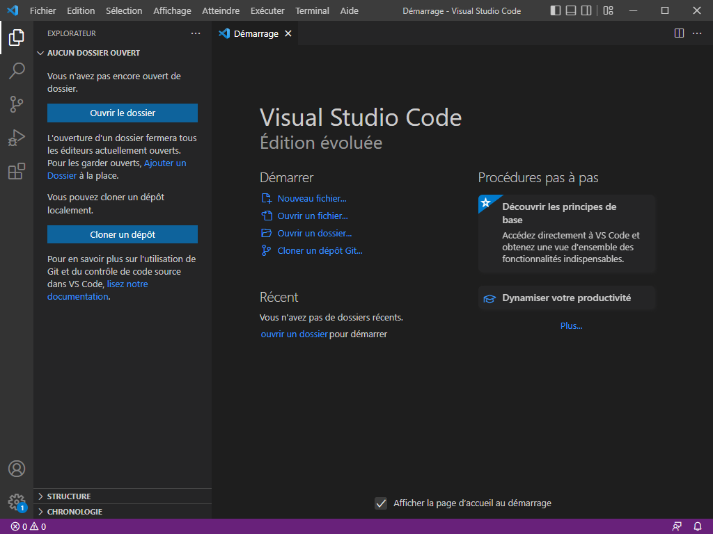
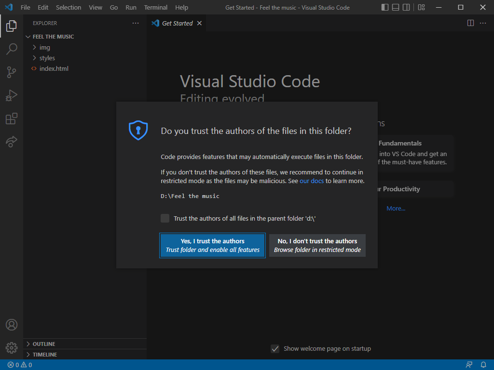
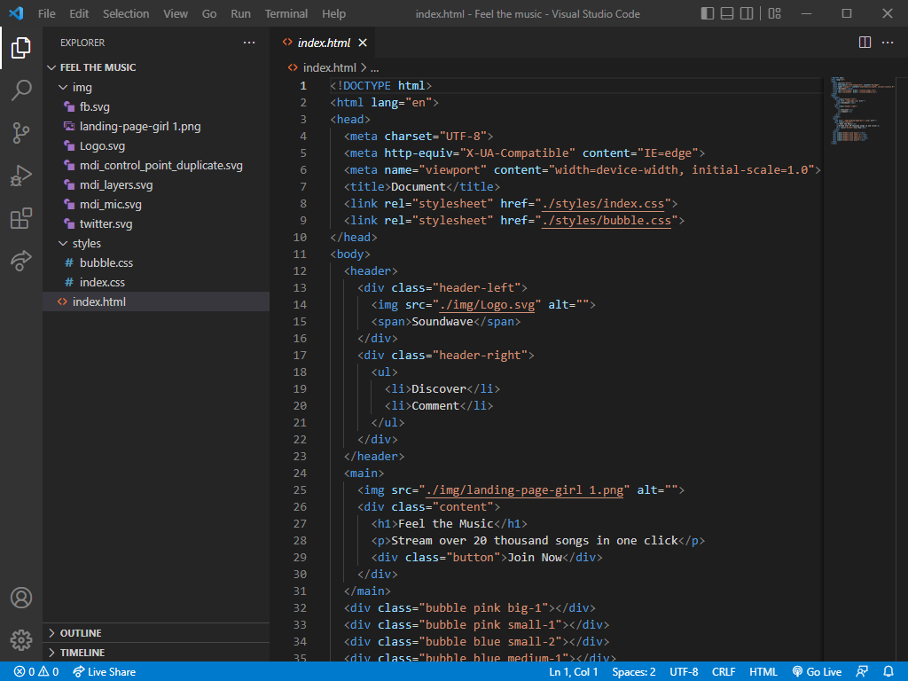
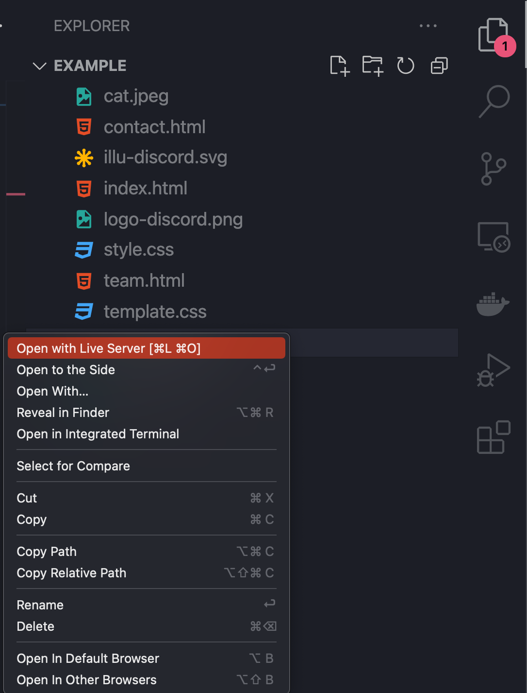

<!-- omit in toc -->
# VSCode, mon amour <3

Pendant cette formation nous utiliserons VSCode comme éditeur de code! Il en existe d'autre évidement (SublimeText, ATOM, Brackets,...) mais histoire de tous commencé sur la même base, VSCode s'est avéré être le choix le plus judicieux. Si par après, lors de ta carrière professionnel, tu décides de changer pour un autre logiciel aucun soucis. Au final c'est juste un éditeur de "texte".

VSCode est un outil merveilleux avec pleins de fonctionnalités, même trop par rapport à ce que l'on a besoin, nous, pour cette formation. Sa première ouverture peut faire peur, mais ne te tracasse pas je vais t'aider à prendre tes marques sur ce logiciel.

<!-- omit in toc -->
## Table des matières

- [L'interface](#linterface)
  - [Écran d’accueil](#écran-daccueil)
  - [Dossier de confiance](#dossier-de-confiance)
  - [Dossier ouvert](#dossier-ouvert)
- [Tips](#tips)
- [Emmet](#emmet)
  - [Structure HTML](#structure-html)
  - [Lorem Ipsum](#lorem-ipsum)
  - [Les listes](#les-listes)
  - [Contenu, Class et ID, multiplicateur, Attribut](#contenu-class-et-id-multiplicateur-attribut)
  - [Cheatsheet](#cheatsheet)
- [Extensions](#extensions)
  - [Live Server](#live-server)
  - [Auto Close / Rename Tag](#auto-close--rename-tag)
  - [Le reste ?](#le-reste-)
- [Raccourcis](#raccourcis)
  - [Les flèches](#les-flèches)
  - [`Alt` + flèches](#alt--flèches)
  - [`Alt` + `Shift` + flèches](#alt--shift--flèches)
  - [`Ctrl` + `Shift` + P](#ctrl--shift--p)
  - [`Alt` + curseur](#alt--curseur)
  - [`Alt` + `suppr`](#alt--suppr)
  - [`Ctrl` + `suppr`](#ctrl--suppr)

## L'interface

### Écran d’accueil

À l'ouverture, pour la première fois, VSCode affiche un écran de démarrage qui vous propose de le configurer. Vous pouvez éventuellement sélectionné votre thème. Ce qui nous intéresse ici c'est la création d'un nouveau fichier ou l'ouverture d'un dossier.

Pour tous les exercices il va falloir travailler dans un dossier, du coup cliquons sur "Nouveau dossier..."

### Dossier de confiance

Quand vous ouvrez un dossier pour la première fois il est possible que VSCode vous demande si vous pouvez avoir confiance envers les auteurs de ce dossier et de ses fichiers. Évidement, dans notre cas, on peut se faire confiance. Cet avertissement est là pour vous prévenir que si vous avez téléchargé du code en ligne et que vous n'êtes pas sûr de la source, il vaudrait mieux ne pas l'exécuter. Il est possible que du code se lance automatiquement et compromette votre ordinateur. Méfiance donc...

### Dossier ouvert

Une fois un dossier ouvert on se retrouve avec l'arborescence de notre dossier sur le côté gauche de la fenêtre de VSCode. De là on peut ouvrir tous les fichiers "texte" que l'on souhaite. Que ce soit de l'HTML, du CSS, du JavaScript ou tout autre langage de programmation. VSCode est aussi capable de vous afficher des images dans la plupart des formats courant (jpg, png,...).

> :white_check_mark: Essayez au plus possible d'avoir un organisation claire de vos dossiers de travail. Par exemple:

<pre>
Nom-de-projet
  |__ img
  |   |__ image.png
  |__ css
  |   |__ style.css
  |__ js
  |   |__ script.js
  |__ pages
  |   |__ contact.html
  |__ index.html
</pre>

## Tips

- Quand tu sélectionnes une balise, sa jumelle est sélectionnée également. Cela te permet de savoir si elle est bien fermée ou non.
- L'indentation automatique te permet également de savoir si tu es dans la bonne balise ou non. Si lorsque tu va à la ligne l'indentation ne te semble pas correcte, c'est probablement que ton code est mal interprété et qu'il y a un soucis quelque part. Jette un coup d'oeil aux balises précédentes pour voir ce qu'il se passe.

## Emmet

On en a déjà parlé, il s'agit d'un petit plugin directement intégré à VSCode qui permet de taper du code HTML et CSS beaucoup plus rapidement. Alors, ça demande un petit temps d'apprentissage aussi pour l'utiliser, mais ça simplifie grandement la vie.

Pour pouvoir l'utiliser correctement il faut bien être dans un document HTML ou CSS. Donc pense bien à l'enregistrer.

Ensuite dès qu'on rentre le nom d'une balise on a déjà Emmet qui te propose de créer les deux balises directement, plus besoin de le faire toi même.

Voici quelques exemples:

### Structure HTML

En écrivant juste `!` et en validant avec `enter` tu peux directement créer ton squelette HTML de base.

> :exclamation: Lors d'une mise à jour de VScode il est possible que cette dernière fonctionnalité ai changée. Il faut désormais activer `Emmet: Use Inline Completions` qui est un paramètre à  dans VSCode. Ainsi, lorsque tu écriras du code Emmet, VScode te montrera directement le résultat et il faudra valider avec `Tab`.

### Lorem Ipsum

Le lorem ipsum est un texte fictif en latin qui est devenu la référence du texte de substitution. C'est à dire un texte que l'on utilise pour remplir nos `
`et `
`dans le but de pouvoir commencer rapidement à styliser notre page, sans devoir attendre le contenu complet.

Pour l'utiliser il suffit d'écrire `lorem`et de valider avec `enter`. Cela va créer un paragraphe de Lorem Ipsum. Si tu veux plusieurs paragraphes tu peux utiliser la commande suivante `lorem*2`qui du coup te créera 2 paragraphe.

### Les listes

Il est également possible de créer des listes plus rapidement, pour ce faire tu n'a qu'a écrire le type de liste que tu veux (`ul`ou `ol`).

Mais ça va plus loin que ça, il y a moyen de directement écrire le nombre de `li` dont tu as besoin dans ta liste: `ul>li*5`. Ceci va créer une liste avec 5 `<li>`. C'est à ça que sert `>`,c'est pour indiquer la descendance.

Et on peut encore pousser le vice plus loin en demandant directement de nous créer une liste et son contenu: `ul>li{lien $}*5`. Ce qui est entre accolades ici c'est le contenu de ma balise `<li>`.

### Contenu, Class et ID, multiplicateur, Attribut

Comme vu plus haut il y a donc moyen de préciser à Emmet le contenu de notre balise en utilisant les `{}`. Il est également possible de lui demander de compter pour nous le nombre d'élément qu'il crée en utilisant `$`, cela va ajouter un chiffre pour chaque fois qu'il doit répéter l'opération avec `*x`

C'est possible de donner la valeur d'un attribut également en utilisant `[]`. Il suffit d'écrire le nom de l'attribut de notre balise comme dans cet exemple: `a[href="#"]`

Il est également possible de préciser la classe ou l'id de notre élément directement: `div.ma-classe` ou `div#monID`

Du coup on peut combiner le tout: `(div.ma-classe#monID$>p>lorem)*5`. Ici ce qui est en parenthèse va être répéter 5 fois. On a un div avec une classe, un id unique et une balise `
` à l'intérieur contenant chacun un paragraphe de Lorem, le tout qui se répète 5 fois. Très pratique!

### Cheatsheet

Bref, vous l'aurez compris, Emmet c'est top quand on apprend à l'utiliser. Alors c'est à vous de faire la démarche, ici je n'ai montré que quelques exemples, mais il y a encore tellement plus.

Voici [un lien vers une cheatsheet](https://docs.emmet.io/cheat-sheet/) et un autre vers [la documentation](https://docs.emmet.io/)

[:arrow_up: Revenir au top](#table-des-matières)

## Extensions

Vous pouvez personnaliser votre expérience avec VSCode au fur et à mesure de votre apprentissage et de votre carrière grâce aux extensions. Ces petits bout de code qui vont venir vous filer un coup de main pour écrire votre code ou modifier le comportement de VSCode.

Normalement sur votre machine, vous avez déjà quelques extensions installées. Nous n'en verrons que l'une ou l'autre.

### Live Server

Live Server permet de simuler un serveur sur votre machine pour voir comment se comporte votre site. Alors dans cette section on ne va pas l'utiliser pleinement. Cependant il a une utilité très intéressant, c'est la prévisualisation et le "refresh live". C'est à dire qu'à chaque fois que vous enregistrez votre page, votre aperçu se met à jour sans que vous deviez rafraîchir votre page.

Pour utiliser Live Server, il suffit d'ouvrir non pas un fichier avec VSCode, mais un dossier. Vous retrouverez dans la barre latéral l'onglet avec vos fichiers, si vous cliquez droit dessus vous aurez l'option `Open with Live Server`

### Auto Close / Rename Tag

Une petite extension qui va vous faciliter la vie. Celles-ci vont, comme leurs noms l'indiquent, fermer automatiquement et renommer vos balises.

### Le reste ?  

Il y a évidement des centaines, des milliers d'extensions. Vous pouvez par exemple installer des thèmes pour votre logiciel ou d'autres extensions qui gère la mise en forme du code.

[:arrow_up: Revenir au top](#table-des-matières)

## Raccourcis

### Les flèches

Ce n'est pas un raccourcis lié à VSCode, mais il est très important d'apprendre à naviguer dans son code à l'aide des flèches. Normalement on garde ses deux mains sur le clavier et ainsi on a plus facile à rectifier du code en utilisant les fmèches.

### `Alt` + flèches

L'utilisation de `alt` est super importante quand vous coder dans VSCode. Le fait de maintenir `alt` et d'ensuite utiliser les flèches haut et bas de votre clavier permet de déplacer une ligne de code. Bien plus pratique que d'utiliser un copier/coller.

### `Alt` + `Shift` + flèches

Ce raccourci permet de dupliquer la ligne sur laquelle se trouve votre curseur actuellement ou la sélection.

### `Ctrl` + `Shift` + P

Ce raccourci permet de faire apparaître la palette de VSCode. Dedans vous pouvez y retrouver différents raccourcis comme celui des préférences ou de vos extensions. Cela est possible tant que `>`se situe devant votre recherche, mais si vous l'effacez vous pouvez aussi rechercher des fichiers!

### `Alt` + curseur

Ce raccourci permet de placer de multiple curseur dans votre document.

### `Alt` + `suppr`

Ce raccourci permet de supprimer mot par mot.

### `Ctrl` + `suppr`

Ce raccourci permet de supprimer toute la ligne où est votre curseur.

[:arrow_up: Revenir au top](#table-des-matières)

[:rewind: Retour au sommaire du cours](./README.md#table-des-matières)
