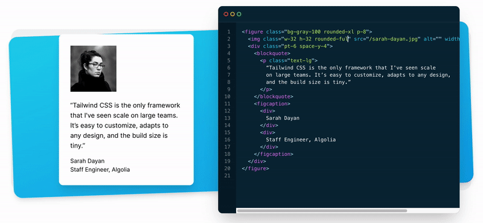
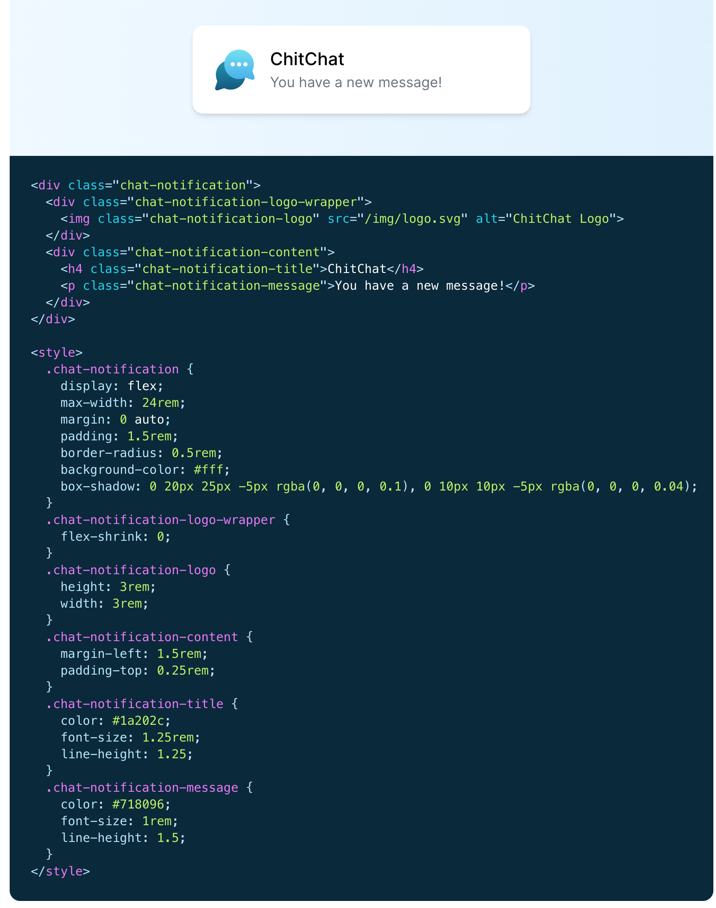
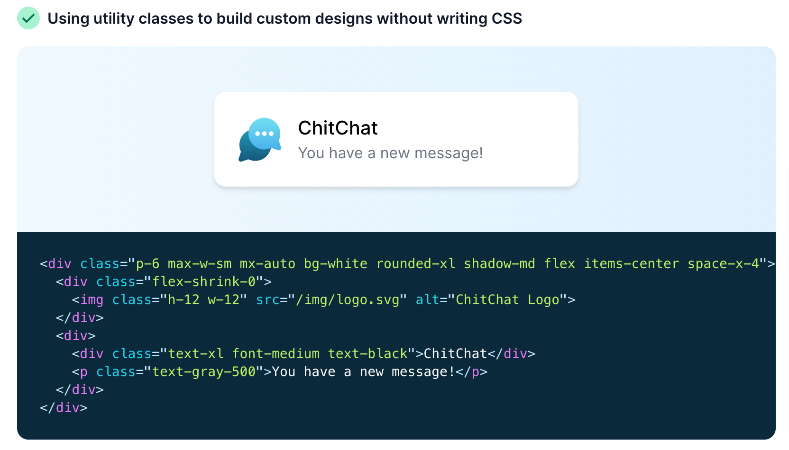

<!-- omit in toc -->
# Tailwind CSS

Tailwind est un framework CSS axé sur un côté "utility-first". Pour simplifier, il propose des classes déjà toute faite pour paramétrer vos éléments HTML directement sans écrire la moindre ligne de CSS.



<!-- omit in toc -->
## Table des matières

- [Principe](#principe)
- [Avantages et inconvénients](#avantages-et-inconvénients)
- [Installation via CDN](#installation-via-cdn)
- [Installation via NPM](#installation-via-npm)
- [LA DOCUMENTATION](#la-documentation)
- [Plugin VSCode (obligatoire!)](#plugin-vscode-obligatoire)

## Principe

Tailwind est finalement qu'une simple feuille de style css comme vous en avez déjà réalisés. Sauf qu'ici toutes les classes sont déjà pré-remplie par des propriétés et valeurs définies qui vont vous permettre d'appliquer rapidement des propriétés tels que `flex`, `color`, `width`,...





Il est possible de le configurer pour qu'il génère la feuille de style avec vos propres codes couleurs ou vos propres fonts. 

La feuille de style fournie à la base est également remplie de code inutile et rallonge le temps de chargement de votre style. Il est donc possible de purger la feuille de tout bout de code non utilisés dans votre projet.

Bref, Tailwind, c'est le bien!

## Avantages et inconvénients

:white_check_mark: L'**avantage** d'utiliser un framework CSS est la possibilité de rapidement mettre en page son site sans devoir écrire des règles et sélecteurs CSS. Il suffit de connaître le nom des classes utilisées par Tailwind pour les appliquer à nos éléments CSS.

:x: Les **inconvénients** principaux sont que du coup on a des classes à rallonges et des répétitions. Ces dernières peuvent être évitées par l'utilisation d'un framework JS (React, Vue,...) mais ce n'est pas le but de ce cours.

```html
<div class="container sm:m-auto lg:w-8/12 w-screen pb-20 bg-gray-600 sm:rounded-3xl  bg-gradient-to-t to-blue-dark from-blue-light ">
  <div class="container m-auto h-28 bg-white w-full sm:rounded-t-3xl flex justify-between items-center px-10 text-black">
    
    <div class="flex">
      <a href="..."><i class="fab fa-facebook-square text-orange text-3xl mr-5"></i></a>
    </div>
  </div>
</div>
```

> Dans le code ci-dessus, il n'y a aucun code CSS écrit en plus du CSS fournit par Tailwind.

[:arrow_up: Revenir au top](#table-des-matières)

## Installation via CDN

On va allez au plus simple et insérer directement le lien vers la feuille de style CSS de Tailwind. Celle-ci étant hébergé dans le cloud. 

```html
<link href="https://unpkg.com/tailwindcss@^2/dist/tailwind.min.css" rel="stylesheet">
```

:x: L'inconvénient de ce système, c'est que l'on ne pourra pas modifier la configuration de Tailwind, comme par exemple ajouter nos propres couleurs ou font. Pour l'instant ce n'est pas grave.

[:arrow_up: Revenir au top](#table-des-matières)

## Installation via NPM

:exclamation: Ceci est une méthode avancé pour installer Tailwind correctement. Ce n'est recommandé que si vous savez ce que vous faites. Je mets un lien vers une vidéo juste à titre informatif pour les plus curieux.

[:desktop_computer: Le tutorial vidéo pour installer Tailwind via NPM :fr:](https://www.youtube.com/watch?v=tAhppkgg70s&ab_channel=LeDesignerduWeb)

[:arrow_up: Revenir au top](#table-des-matières)

## LA DOCUMENTATION

Alors, maintenant il va falloir apprendre à vous débrouiller en consultant la documentation. On va la parcourir ensemble cette [documentation officielle de Tailwinds](https://tailwindcss.com/docs), en plus elle est super bien faite! Mais par après, il faudra vous même allez la consulter quand vous aurez besoin de retrouver une classe ou l'autre.

## Plugin VSCode (obligatoire!)


Tailwind fournit une extension pour VSCode qui est juste parfaite. Elle vous auto-suggère des classes et si vous ne savez pas ce que fait cette classe, il suffit de passer sa souris dessus et le code CSS complet vous est montré!

[:floppy_disk: Je veux installer cette extension](https://marketplace.visualstudio.com/items?itemName=bradlc.vscode-tailwindcss)

[:arrow_up: Revenir au top](#table-des-matières)

[:rewind: Retour au sommaire du cours](./README.md#table-des-matières)
