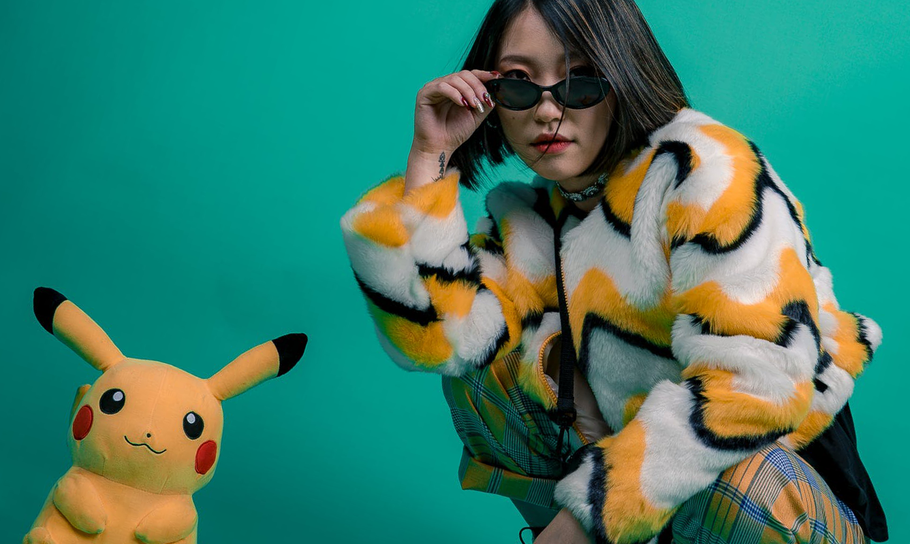

# Exercice Maquette Creative

Tu vas devoir travailler avec un collègue pour reproduire cette maquette de la manière la plus précise possible.

## :memo: Objectifs

- Réaliser une maquette de type professionnel
- Suivre des consignes précises

## :white_check_mark: Evaluations

- Respect des consignes
  - La page présente tous les éléments demandés
  - Présence de plusieurs feuilles de style
- La syntaxe est correcte
- L'indentation est correcte
- Organisation des fichiers/dossier correcte

## Consigne

Par groupe de 2-3 vous allez devoir vous répartir la charge de travail pour réaliser la maquette finale. C'est une maquette bien plus complexe que celles déjà réalisés auparavant. C'est pourquoi il va falloir bien vous coordonner.

Voici quelques conseils:

- Quelqu'un doit se charger de l'ensemble du projet, c'est à lui qu'il faudra remettre les différentes parties de la maquette et c'est lui qui les incorporeras dans la page final (index.html)
- Ensuite répartissez-vous le travail.
- Procédez blocks par blocks. Créez-les dans une page vide de tout autre élément. Chaque partie sera un composant avec sa propre feuille de style. Assurez-vous que votre composant fonctionne et puis intégrez le dans le reste du travail (index.html).
- Créer une feuille de style commune dans laquelle vous viendrez faire vos imports de vos feuilles de style.
- Il ne faut pas reproduire à l'identique le contenu. Par exemple sur la page d'accueil, pas besoin d'afficher nécessairement 4 articles dans le container central, tout comme il n'est pas obligé d'en avoir trois dans le widget "Recent Posts". Faites en sortes que le CSS soit prêt pour accueillir un nombre "illimité" de contenu.
- Responsive? Ne vous pré-occupez pas trop des différentes versions (tablet/smartphone) pour le moment. Essayez déjà d'approcher le plus possible du résultat desktop. Mais si vous avancez bien, pourquoi ne pas essayer du coup.

## Groupes

Groupe 1 | Groupe 2 | Groupe 3
--- | --- | ---
Jason |  |
Aristide |  |
Yvan

## Informations maquette

Voici les informations fournie par votre designer concernant la maquette. Malheureusement il n'a pas de compte Figma pro et ne peut pas vous y donner accès. Vous allez devoir vous contenter de ses informations et des screenshots.

- Votre designer vous a envoyé des screenshots d'une page d'accueil et d'une page d'article complet. Reproduisez les deux.
- Le site à un container de largeur maximum de **1200px**
- **Page d'accueil:** Le container des articles sur la page principale fait **800px** max de largeur.
- **Page d'accueil:** La sidebar fait **332px** max de largeur.
- **Page d'accueil:** Le carrousel fait **1600px** max de largeur et **480px** de hauteur.
- **Page d'article complet:** L'image de l'article fait une largeur max de **786px** sur **491px** en hauteur max
- Les couleurs:
  - Le background: **#33264E**
  - Le background footer et le bg des cards des articles: **#362953**
  - Les liens et éléments important: **#EE3E52**
  - Les couleurs du gradient sur les boutons: **#FF6071** / **#FF7E8E**
  - Les couleurs des catégories:
    - **#673AB7**
    - **#5567DA**
    - **#1E88E5**
    - **#27CC81**
    - **#38C4D1**
    - **#E91E63**
  - Les couleurs des réseaux sociaux;:
    - Twitter **#63CDF1**
    - Facebook **#507CBE**
    - Instagram **#D62976**
    - Pinterest **#EE3E52**
- Les polices:
  - Le logo utilise **Vampiro One**
  - Les titres utilisent **Playfair Display**
  - Le texte est en **Muli** / **Mulish**
  - Ce sont des Google Font
  - La taille n'a pas d'importance tant que vous respectez l'échelle établie dans la maquette.
- Les icônes:
  - Le fond des icônes est un dégradé dont les couleurs sont notés plus haut.
  - Les icônes en elle-même peuvent être différentes tant qu'elle transmette le même message (liens sociaux, recherche, commentaires, partager)
  - Utilisez Font-Awesome.

## Screenshots

Vous pouvez retrouver tous les screenshots sur [Google Drive](https://drive.google.com/drive/folders/1x6AU9gIeHi-FXgQAhRd5iG6twRYGevPP?usp=sharing)

Vous y trouverez également une sélection d'images qui peuvent servir d'illustration d'article. Mais n'hésitez pas utiliser les vôtres. Si vous en êtes en panne d'inspiration, je vous conseille le site [Pexels](https://www.pexels.com/fr-fr/) qui regorge d'images libre de droit pour utiliser dans vos maquettes !

## Utiliser Tailwind

Si vous voulez utiliser Tailwind, c'est tout à fait possible. Comme on a pas vu comment l'installer et le configurer, il faudra faire avec la feuille de style de Tailwind et ajouter vos couleurs dans une feuilles de styles bien à vous.
